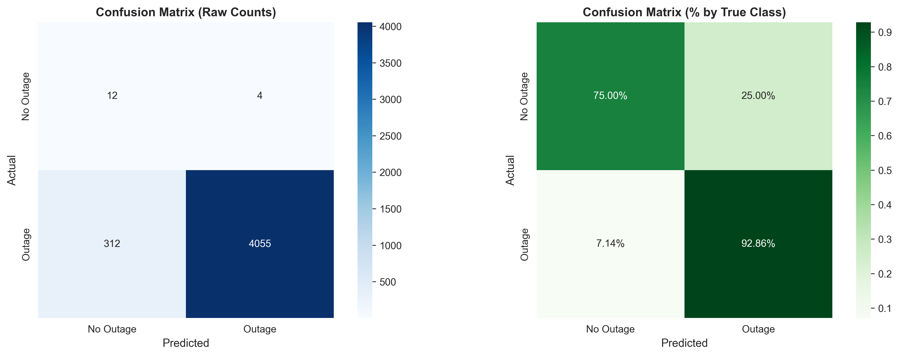
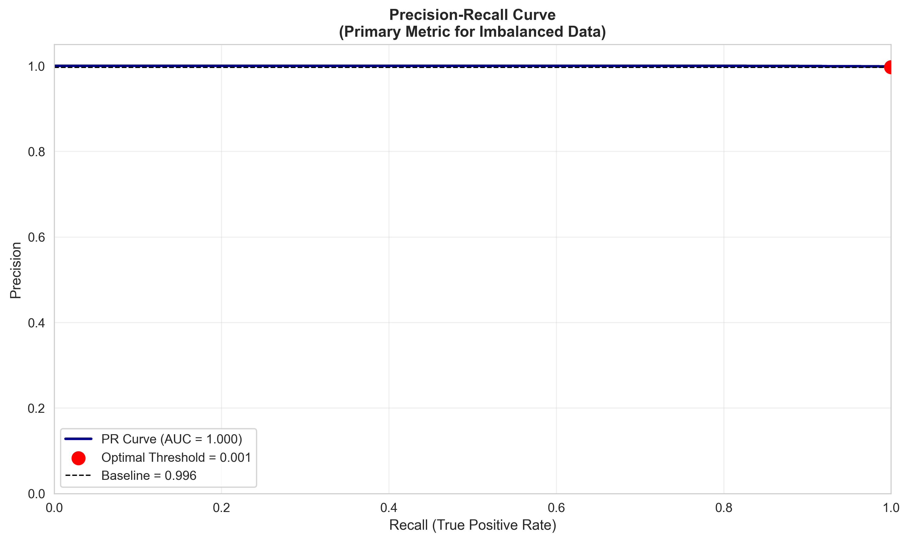
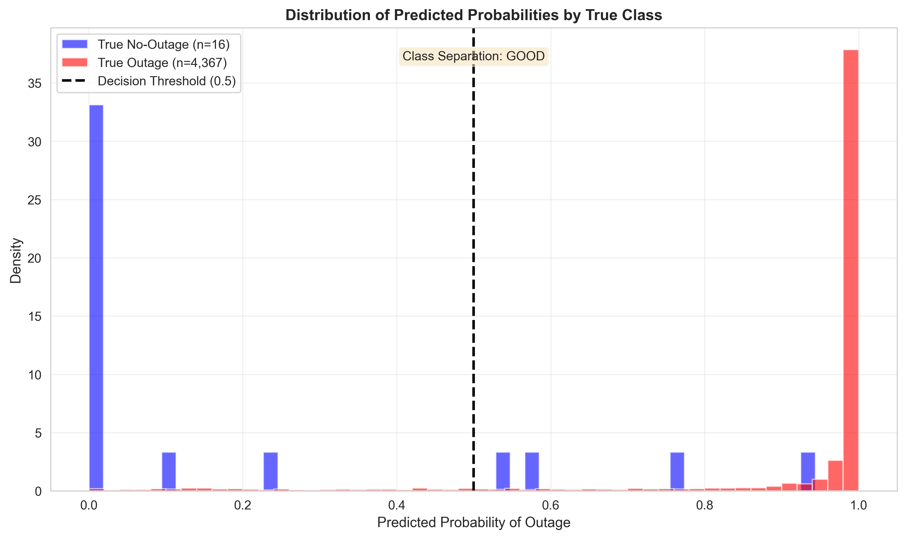

## Quick Start

### 1. Environment Setup

First, obtain a NOAA Climate Data Online API token:

1. Visit https://www.ncei.noaa.gov/cdo-web/token
2. Register for a free token
3. Create `.env` file and add your token:

```
NOAA_CDO_TOKEN=your_token_here
```

### 2. Install Dependencies

```bash
pip install -r requirements.txt
```

### 3. Run the Data Processor

#### Complete Workflow (Recommended)

```bash
cd src/data_collection
python main_dataprocessor.py
```

#### Custom Date Range

```bash
python main_dataprocessor.py --start-year 2020 --end-year 2024
```

#### Validate Environment Only

```bash
python main_dataprocessor.py --validate-only
```

## What It Does

The main data processor will:

1. **Collect Weather Data**: Download 5 years of weather data for 12 diverse U.S. counties
2. **Create Unified Dataset**: Combine all county data into a single structured dataset
3. **Engineer Features**: Generate 70+ ML features from raw weather data
4. **Generate Reports**: Create summary reports and data quality analysis

## Output Structure

After successful processing, you'll have:

```
raw/                    # Original weather station data
processed/             # Unified county datasets
ml_ready/              # ML-ready features and reports
```

## Target Counties

The processor collects data for these strategically selected counties:

- **Texas**: Harris County (Houston), Bexar County (San Antonio)
- **Florida**: Miami-Dade County, Orange County (Orlando)
- **California**: San Diego County, San Francisco County
- **Northeast**: Suffolk County (Boston), New York County (Manhattan)
- **Other**: Fairfax County (VA), Cook County (IL), Fulton County (GA), King County (WA)

## Features Generated

The processor creates features targeting different outage causes:

- **Temperature Stress**: Thermal cycling, degree days, heat waves, freeze cycles
- **Precipitation Impact**: Accumulation patterns, intensity, soil saturation indicators
- **Wind Damage**: Speed categories, sustained winds, acceleration, fatigue factors
- **Compound Risks**: Ice storms, wet/windy combinations, multiple hazards
- **Temporal Patterns**: Seasonal effects, consecutive extreme days

## Data Dictionary & Abbreviations

### Core Weather Measurements (NOAA CDO)

| **Abbreviation** | **Full Name**         | **Units**   | **Description**                                 |
| ---------------- | --------------------- | ----------- | ----------------------------------------------- |
| **AWND**         | Average Wind Speed    | mph         | Daily average wind speed                        |
| **PRCP**         | Precipitation         | 0.01 inches | Total daily precipitation                       |
| **TMAX**         | Maximum Temperature   | °C          | Daily maximum temperature                       |
| **TMIN**         | Minimum Temperature   | °C          | Daily minimum temperature                       |
| **WSF2**         | Fastest 2-Minute Wind | mph         | Peak sustained wind speed (power grid critical) |
| **WSF5**         | Fastest 5-Second Wind | mph         | Peak wind gust                                  |

### Weather Type Codes (WT01-WT11)

| **Code** | **Weather Type**                    | **Power Outage Risk** | **Description**                             |
| -------- | ----------------------------------- | --------------------- | ------------------------------------------- |
| **WT01** | Fog/Visibility ≤ 0.25 miles         | Low                   | Reduced visibility, minor transport issues  |
| **WT02** | Heavy Fog/Visibility ≤ 0.0625 miles | Medium                | Severe visibility reduction                 |
| **WT03** | Thunder                             | High                  | Lightning strikes (direct equipment damage) |
| **WT04** | Ice pellets/sleet                   | **Very High**         | Ice loading on power lines                  |
| **WT05** | Hail                                | High                  | Physical equipment damage                   |
| **WT06** | Glaze/rime ice                      | **Very High**         | Line icing (critical for power grid)        |
| **WT08** | Smoke/haze                          | Low                   | Air quality issues                          |
| **WT11** | High/damaging winds                 | **Very High**         | Tree contact, line breaks                   |

### Temporal Feature Naming Convention

| **Pattern**                     | **Meaning**      | **Example**                        | **Purpose**                  |
| ------------------------------- | ---------------- | ---------------------------------- | ---------------------------- |
| **\_lag1d, \_lag2d, \_lag3d**   | 1, 2, 3 days ago | `PRCP_lag1d` = yesterday's rain    | Capture weather persistence  |
| **\_3d, \_7d, \_14d**           | Rolling windows  | `TMAX_7d_mean` = week average temp | Identify trends and patterns |
| **\_sum, \_mean, \_max, \_min** | Aggregation type | `PRCP_3d_sum` = 3-day total rain   | Different impact measures    |

### Risk Indicator Features (Binary 0/1)

| **Feature**                 | **Threshold/Logic**         | **Outage Risk** | **Rationale**                         |
| --------------------------- | --------------------------- | --------------- | ------------------------------------- |
| **heavy_rain**              | PRCP > 25mm/day             | Medium          | Flooding, saturated soil around poles |
| **extreme_rain**            | PRCP > 50mm/day             | **High**        | Flash floods, washouts                |
| **heat_wave**               | 3+ consecutive hot days     | High            | Sustained demand stress               |
| **extreme_heat**            | TMAX > 35°C (95°F)          | **Very High**   | Peak demand, equipment overheating    |
| **freezing**                | TMIN < 0°C (32°F)           | High            | Ice formation on lines                |
| **extreme_cold**            | TMIN < -10°C (14°F)         | **Very High**   | Brittle lines, thermal stress         |
| **high_winds**              | WSF2 > 39 mph               | High            | Tree contact with lines               |
| **damaging_winds**          | WSF2 > 58 mph               | **Very High**   | Direct line damage                    |
| **consecutive_heat_days**   | Count of heat wave duration | High            | Cumulative thermal stress             |
| **consecutive_freeze_days** | Count of freeze duration    | High            | Ice accumulation                      |
| **consecutive_rain_days**   | Count of wet period         | Medium          | Soil saturation, tree instability     |

### Compound Risk Features

| **Feature**                 | **Description**        | **Power Outage Impact** | **Formula/Logic**                     |
| --------------------------- | ---------------------- | ----------------------- | ------------------------------------- |
| **ice_storm_risk**          | Freezing rain + wind   | **Critical**            | Ice formation during windy conditions |
| **wet_windy_combo**         | Heavy rain + high wind | **High**                | Saturated soil + wind throw trees     |
| **thermal_stress_index**    | Temperature volatility | High                    | Daily temp range + multi-day changes  |
| **mechanical_stress_index** | Wind + ice loading     | **Critical**            | Combined physical stresses            |
| **weather_severity_score**  | Overall daily severity | Variable                | Composite risk assessment             |
| **multiple_extremes**       | 2+ extreme conditions  | **High**                | Multiplicative risk effects           |

### Derived Meteorological Features

| **Feature**              | **Description**              | **Units** | **Outage Relevance**          |
| ------------------------ | ---------------------------- | --------- | ----------------------------- |
| **heating_degree_days**  | Energy demand for heating    | °C-days   | Winter demand stress          |
| **cooling_degree_days**  | Energy demand for cooling    | °C-days   | Summer demand stress          |
| **temp_range_daily**     | TMAX - TMIN                  | °C        | Thermal expansion/contraction |
| **temp_volatility_3d**   | 3-day temperature variance   | °C²       | Equipment stress cycles       |
| **freeze_thaw_cycle**    | Temperature crosses 0°C      | Binary    | Line expansion/contraction    |
| **days_since_rain**      | Drought/dry period indicator | Days      | Fire risk, demand patterns    |
| **wind_acceleration_1d** | Wind speed change rate       | mph/day   | Dynamic loading stress        |

### Categorical Variables

| **Variable**            | **Categories**                                                            | **Use Case**                      |
| ----------------------- | ------------------------------------------------------------------------- | --------------------------------- |
| **season**              | winter, spring, summer, fall                                              | Seasonal outage patterns          |
| **climate_zone**        | mediterranean, tropical, humid_subtropical, humid_continental, oceanic    | Regional risk profiles            |
| **outage_risk_profile** | wildfires_psps, hurricanes_thunderstorms, ice_storms_severe_weather, etc. | County-specific risk patterns     |
| **state**               | CA, FL, GA, IL, MA, NY, TX, VA, WA                                        | Geographic regulatory differences |

### Geographic Identifiers

| **Variable**    | **Description**                              | **Example**               |
| --------------- | -------------------------------------------- | ------------------------- |
| **county_fips** | Federal Information Processing Standard code | 48201 (Harris County, TX) |
| **county_name** | Full county name                             | "Harris County"           |
| **state**       | Two-letter state code                        | "TX"                      |


# Outage Data Processing (EAGLE-I -----> Daily Labels)

Converts raw EAGLE-I outage snapshots into daily, county-level labels that align with the weather features.

---

## What It Does

### Per-Year Daily Rollups (`make_outage_daily.py`)

- Auto-detects raw schema differences across years (e.g., sum vs customers_out)
- Converts UTC snapshots to the county’s local calendar day (Pacific/Central/Eastern; DST-aware 23/24/25h)
- Computes daily metrics from positive snapshots only (no fabricated zero rows):

  - any_out (0/1)
  - num_out_per_day (event count; new event if gap > 30 min or day changes)
  - minutes_out
  - customers_out (daily peak)
  - customers_out_mean (mean over observed rows)
  - cust_minute_area (customer-minutes = severity × duration)

- Percent metrics with MCC.csv (customer counts by county):
  - pct_out_max = customers_out / customers_total
  - pct_out_area = cust_minute_area / (customers_total × minutes_in_local_day)

---

### Combine All Years (`combine_outages_daily.py`)

- Harmonizes schema/dtypes, zero-pads FIPS, normalizes dates
- Drops exact duplicates on (fips_code, run_start_time_day)
- Produces a single multi-year CSV

---

### Add DST-Aware & Coverage-Adjusted Labels (`make_labels_from_combined.py`)

- Adds minutes_in_local_day (23/24/25h by county/day)
- Infers snapshot_minutes, computes snapshots_count, minutes_observed, coverage
- Produces two rate labels:

  - pct_out_area_unified = cust_minute_area / (customers_total × minutes_in_local_day) (DST-aware, report-friendly)
  - pct_out_area_covered = cust_minute_area / (customers_total × minutes_observed) (coverage-adjusted, train-friendly)

- Adds train_mask = (customers_total > 0) & (coverage ≥ 0.8)

---

### Merge with Weather Features (`merge_weather_outages_keep_all.py`)

- Drops overlapping column names from the outage table (except join keys), then left-joins outages → weather


# Preprocessing Module

## Preprocessing Step 1: Missing Value Handling

### Components

#### 1. MissingValueAnalyzer

Diagnoses missing data patterns and generates reports.

#### 2. ImputationStrategy (Abstract Base Class)

- `ConstantImputation`: Fill with constant value (0 for binary/precipitation)
- `ForwardFillImputation`: Carry forward last observation within groups
- `InterpolationImputation`: Linear interpolation for smooth temporal features
- `MeanImputation`: Fill with group-wise or global mean

#### 3. MissingValueHandler

Orchestrates imputation pipeline with domain-specific strategies for different feature types.

### Imputation Strategy by Feature Type

| Feature Group                  | Strategy             | Columns Affected  | Rationale                             |
| ------------------------------ | -------------------- | ----------------- | ------------------------------------- |
| Weather type codes (WT01-WT11) | Constant (0)         | 8 columns         | Missing indicates event did not occur |
| Precipitation                  | Constant (0)         | PRCP, PRCP_lag\*  | No precipitation recorded             |
| Temperature                    | Linear interpolation | TMAX, TMIN, lags  | Smooth temporal variation             |
| Wind base                      | Forward fill         | WSF2, WSF5, AWND  | Carry forward recent conditions       |
| Wind derived                   | Group mean           | WSF2_3d_max, etc. | Complex derived features              |
| Binary indicators              | Constant (0)         | 16 features       | Absence of extreme event              |
| Outage labels                  | Constant (0)         | 8 features        | No outage observed                    |
| Continuous derived             | Forward fill         | 8 features        | Maintain temporal continuity          |
| Stress indices                 | Group mean           | 3 features        | Complex derived metrics               |

## Results

### Before Imputation

- Total missing values: **219,619**
- Columns with missing: **48 / 108 (44.4%)**
- Most affected:
  - WT05: 99.6% missing
  - WT11: 99.5% missing
  - WT04: 99.4% missing
  - Wind measurements: ~9% missing

### After Imputation

- Total missing values: **33,670**
- Columns with missing: **30 / 108 (27.8%)**
- Reduction: **84.7%**
- Remaining missing values primarily in wind measurements for counties without wind sensors

### Key Improvements

- Eliminated all missing values in weather type codes
- Eliminated all missing values in precipitation features
- Reduced temperature missing values by 99.4% (144 remaining)
- Reduced outage label missing values to 0
- Maintained data integrity with county-grouped imputation

## Usage

### Command Line

```bash
python src/preprocessing/run_missing_value_imputation.py \
    --input data/processed/merged_weather_outages_2019_2024_keep_all.csv \
    --output data/ml_ready/merged_weather_outages_2019_2024_imputed.csv \
    --report results/reports/missingness_report.csv
```


## Output Files Generated

1. `./data/ml_ready/merged_weather_outages_2019_2024_imputed.csv` - Full imputed dataset (25,993 rows × 108 columns)
2. `results/reports/missingness_report.csv` - Detailed missing value analysis by column


## Model Creation
## Logistic Regression

### Step 1: Train the Model

```bash
cd /Users/adewaleadenle/Downloads/Dev/BTT_project
python src/models/train_logistic_regression.py
```


**What it does:**

- Loads encoded dataset (25,993 rows × 120 columns)
- Uses 51 selected features from feature selection
- Temporal split: 2019-2022 (train), 2023 (val), 2024 (test)
- Tests 20 random hyperparameter combinations
- Saves best model to `models/trained/logistic_regression_best.pkl`
- Saves training log to `results/models/logistic_regression_training_log.txt`


### Step 2: Evaluate the Model

```bash
python src/models/evaluate_model.py
```

**What it does:**

- Loads trained model
- Evaluates on 2024 test set
- Generates comprehensive metrics report
- Saves predictions with probabilities
- Outputs: `results/models/logistic_regression_evaluation.txt`


### Step 3: Generate Visualizations

```bash
python src/models/visualize_results.py
```

## Key Features

### Hyperparameter Tuning

The model tests 20 random combinations of:

- **C**: [0.001, 0.01, 0.1, 1, 10, 100] (regularization strength)
- **penalty**: ['l1', 'l2'] (regularization type)
- **solver**: ['liblinear', 'saga'] (optimization algorithm)
- **max_iter**: [1000, 2000] (convergence iterations)
- **class_weight**: ['balanced'] (fixed to handle imbalance)

### Evaluation Metrics

**Primary Metrics (for imbalanced data):**

- Precision-Recall AUC (most important)
- ROC-AUC
- F1-Score

### Temporal Split Rationale

The dataset uses temporal split instead of random split(sklearn train_test_split) because:

1. Features include lag values (1-3 days)
2. Features include rolling windows (3, 7, 14 days)
3. Random split would leak future information into training

**Split Strategy:**

- Train: 2019-2022 (4 years for learning patterns)
- Validation: 2023 (1 year for hyperparameter tuning)
- Test: 2024 (1 year for final evaluation)

### Class Imbalance Handling

The dataset has severe class imbalance:

- No-outage: 4.36% (minority class)
- Outage: 95.64% (majority class)

**Solution:** `class_weight='balanced'`

- Automatically calculates weights: n_samples / (n_classes × class_count)
- Minority class weight: ~22x (penalizes misclassifying no-outage days heavily)
- Majority class weight: ~0.05x (lower penalty for outage misclassification)

This forces the model to pay attention to both classes instead of simply predicting "outage" for everything.

## Interpreting Results

### Precision-Recall AUC (Primary Metric)

- **> 0.8**: Strong performance
- **0.6 - 0.8**: Moderate performance
- **< 0.6**: Baseline/weak performance

For imbalanced classification, PR-AUC is more informative than ROC-AUC because it focuses on the minority class performance.

### Feature Coefficients

- **Positive coefficients**: Weather patterns that increase outage risk
- **Negative coefficients**: Conditions that decrease outage risk
- **Larger absolute value**: Stronger influence on predictions

Expected important features:

- High wind speeds (WSF2, damaging_winds)
- Extreme temperatures (extreme_heat, extreme_cold)
- Heavy precipitation (extreme_rain, heavy_rain)
- Compound risk factors (ice_storm_risk, wet_windy_combo)


## Result
Model saved to :models/trained/logistic_regression_best.pkl

### - Test Set (2024) Accuracy: 92.79%

  However, I need to explain why accuracy is misleading for the dataset:

  #### Why Accuracy is Deceptive Here
  The test set has extreme class imbalance:
  No-outage: 16 samples (0.37%)
  Outage: 4,367 samples (99.63%)
  A "dumb model" that always predicts "outage" would get 99.63% accuracy without learning anything useful!

### - PR-AUC: 0.9999 (99.99%)
  Means it perfectly distinguishes between classes despite the severe imbalance
### - ROC-AUC: 0.9684 (96.84%)
  Means it catches most actual outages
### - F1-Score: 0.9625 (96.25%)
  Means when it predicts an outage, it's almost always correct


## Data Visualization
Visuals saved to : /Users/adewaleadenle/Downloads/Dev/BTT_project/results/figures/logistic_regression/


### 1. Confusion Matrix
Shows the model's classification performance with both raw counts and percentages.



**Interpretation:**
- Top-left (12): Correctly predicted no-outage days (75%)
- Top-right (4): False alarms - predicted outage but no outage occurred (25%)
- Bottom-left (312): Missed outages - failed to predict actual outages (7.1%)
- Bottom-right (4,055): Correctly predicted outages (92.9%)


### 2. Precision-Recall Curve (PRIMARY METRIC)
The most important metric for imbalanced classification.



**PR-AUC: 0.9999** - Near-perfect performance at balancing precision and recall.


### 3. ROC Curve
Standard classification performance metric.


**ROC-AUC: 0.9684** - Excellent discrimination between classes.


### 4. Feature Coefficients
Shows which weather patterns drive outage predictions.


**Green bars**: Weather conditions that INCREASE outage risk  
**Red bars**: Conditions that DECREASE outage risk


### 5. Prediction Distribution
Histogram showing how well the model separates the two classes.



**Blue**: Actual no-outage days  
**Red**: Actual outage days  
Good separation indicates the model distinguishes classes well.